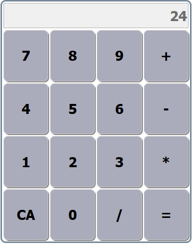

# JavaScriptCalc

Simple calculator made with JavaScript and HTML. Jquery used as a javascript library for
event handling. You can demo it here -> https://codepen.io/Aldiebb/pen/zbxOQW

# Author

Aleksi Tani, aleksitani@gmail.com

